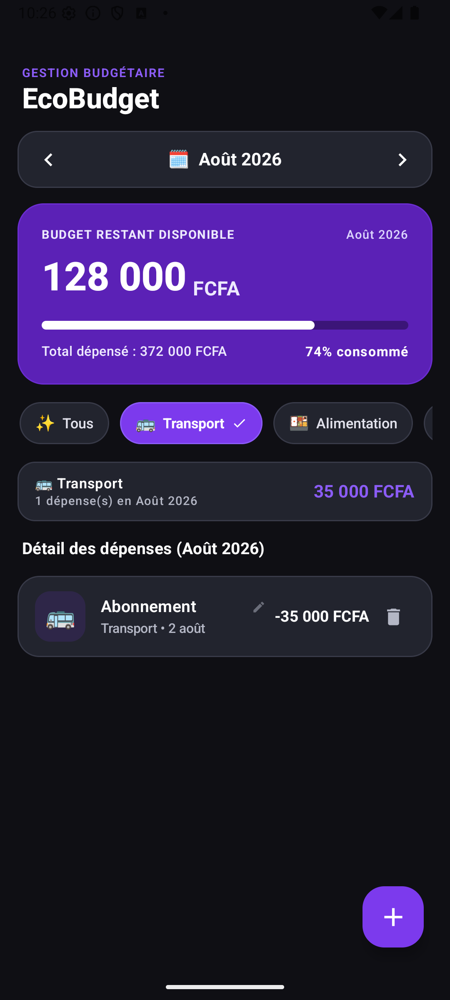
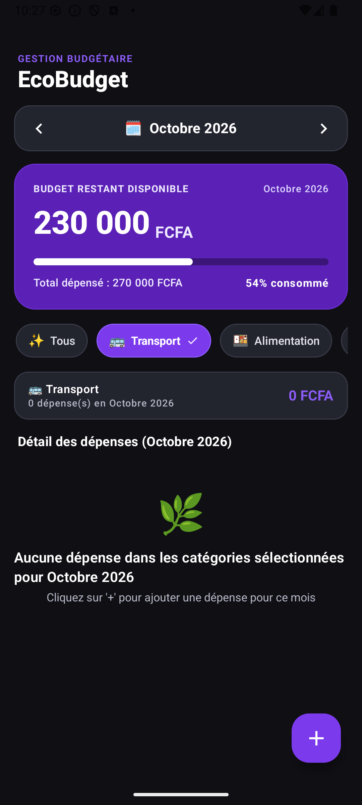
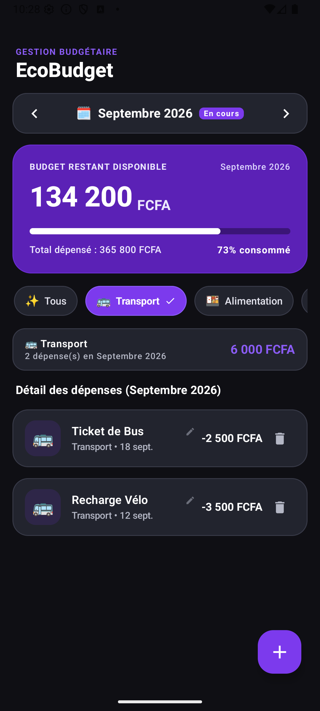
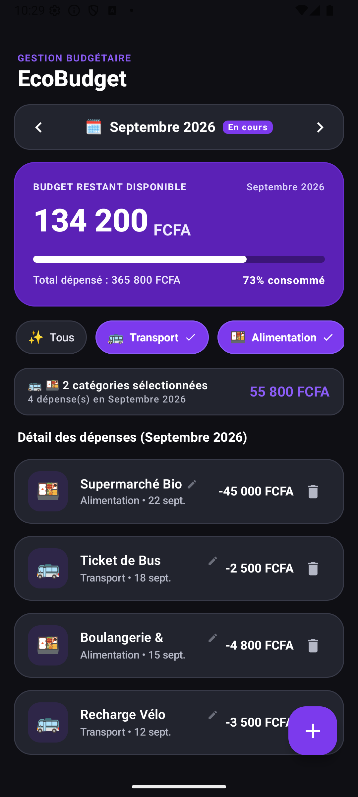
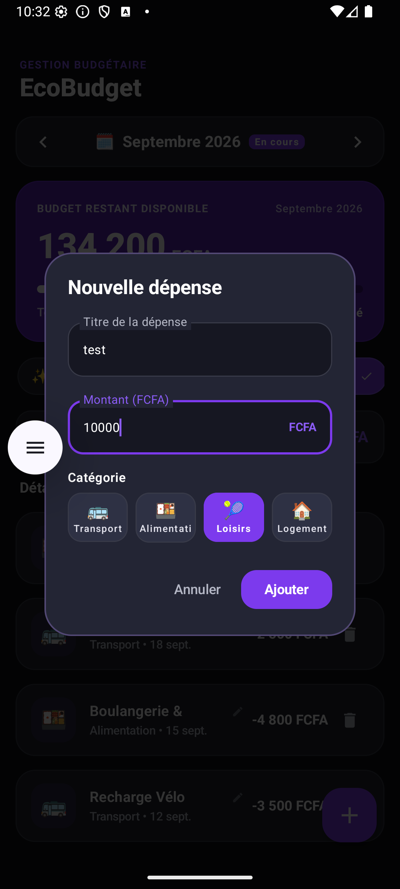

# EcoBudget — Migration vers Kotlin Multiplatform (KMP)

**Étudiant : KORA AKA AMON**
**Dépôt :** https://github.com/amon-kora/ecobudget-kora — branche `test-maison--du-29-08-2026`

---

## 1. Contexte et objectifs

EcoBudget est une application Android de suivi des dépenses mensuelles en FCFA (tableau de bord, calcul du budget restant, navigation mois par mois, filtres par catégorie).

L'objectif du projet est de faire évoluer cette application vers une architecture **Kotlin Multiplatform (KMP)** et **Compose Multiplatform (CMP)** :

- la logique métier, les données, l'état d'interface, le ViewModel et les textes sont placés dans un module partagé `shared` ;
- ce module cible **Android et iOS** ;
- l'application Android native `app` consomme ce socle commun **sans perdre aucune fonctionnalité**.

### Point de départ

Mon travail a consisté à :

1. faire compiler et exécuter le projet en local ;
2. **analyser** chaque fichier migré dans `commonMain` (problème, solution, justification) ;
3. **corriger les régressions** constatées par rapport à l'application Android d'origine ;
4. **compléter** la migration (dépôt de test, état UI séparé) ;
5. **valider** le fonctionnement sur émulateur Android.

---

## 2. Environnement

| Élément | Version |
|---|---|
| IDE | Android Studio (Windows) |
| Kotlin | 2.0.21 |
| Android Gradle Plugin | 8.8.1 |
| Compose Multiplatform (plugin `org.jetbrains.compose`) | 1.6.11 |
| kotlinx-coroutines-core (module `shared`) | 1.7.3 |
| kotlinx-datetime | 0.6.0 |
| lifecycle-viewmodel (JetBrains KMP) | 2.8.0 |
| Ktor client | 2.3.12 |
| Émulateur | Medium Phone API 36 |

> Sous Windows, les cibles iOS sont **déclarées** mais ne peuvent pas être **compilées** (le SDK Apple exige macOS). Gradle l'indique par l'avertissement « The following Kotlin/Native targets cannot be built on this machine ». C'est le comportement attendu, comme indiqué dans le support de cours.

---

## 3. Architecture du projet

```
ecobudget-kora/
├── app/                                  ← Application Android native (UI Jetpack Compose)
│   └── src/main/java/com/example/
│       ├── MainActivity.kt
│       └── ui/ (screens, components, theme)
│
└── shared/                               ← Module Kotlin Multiplatform
    ├── build.gradle.kts
    └── src/
        ├── commonMain/
        │   ├── composeResources/values/strings.xml   ← textes partagés
        │   └── kotlin/com/example/
        │       ├── model/          Transaction, Category, YearMonth
        │       ├── data/repository/ TransactionRepository, FakeTransactionRepository,
        │       │                    NetworkTransactionRepository
        │       ├── di/             AppModule
        │       ├── utils/          UUID.kt, Time.kt (expect)
        │       └── viewmodel/      EcoBudgetUiState, EcoBudgetViewModel
        ├── androidMain/kotlin/com/example/utils/   UUID.kt, Time.kt (actual Android)
        └── iosMain/kotlin/com/example/utils/       UUID.kt, Time.kt (actual iOS)
```

**Principe :** tout ce qui est dans `commonMain` est écrit **une seule fois** et compilé pour Android (bytecode JVM) et pour iOS (binaire natif via Kotlin/Native). Aucune référence à `java.*` ou `android.*` n'y est autorisée. Une recherche `import java.` et `import android.` dans `shared/src/commonMain` renvoie **0 résultat**.

---

## 4. Infrastructure partagée

### 4.1 `shared/build.gradle.kts`

**Plugins**

| Plugin | Rôle |
|---|---|
| `kotlin("multiplatform")` | Compilation multiplateforme du module |
| `com.android.library` | Génère la bibliothèque Android consommée par `app` |
| `org.jetbrains.kotlin.plugin.compose` | Compilateur Compose, obligatoire depuis Kotlin 2.0 |
| `org.jetbrains.compose` (1.6.11) | Compose Multiplatform et génération de la classe `Res` |
| `kotlin("plugin.serialization")` (2.0.21) | Sérialisation JSON sans réflexion Java |

**Cibles**

- `androidTarget` avec `jvmTarget = JVM_17` ;
- `iosX64()`, `iosArm64()`, `iosSimulatorArm64()` avec génération d'un framework statique `shared` pour Xcode.

**Dépendances**

| Source set | Dépendances |
|---|---|
| `commonMain` | coroutines-core, lifecycle-viewmodel (JetBrains), `compose.runtime`, `compose.components.resources` (en `api` pour être visible depuis `app`), kotlinx-datetime, Ktor core + content-negotiation + JSON, kotlinx-serialization-json |
| `androidMain` | `ktor-client-okhttp` (moteur réseau Android) |
| `iosMain` | `ktor-client-darwin` (moteur réseau iOS, basé sur URLSession) |

**Bloc `android`** : `namespace = "com.example.shared"` (différent de `com.example` pour éviter un conflit de classe `R`), `compileSdk = 34`, `minSdk = 24`, Java 17.

**Bloc `compose.resources`** : `publicResClass = true`. Par défaut, la classe `Res` générée est `internal` : sans cette option, le module `app` ne pourrait pas accéder aux textes partagés.

### 4.2 Liaison avec l'application

- `settings.gradle.kts` : `include(":shared")`
- `app/build.gradle.kts` : `implementation(project(":shared"))`

---

## 5. Analyse fichier par fichier (`commonMain`)

Pour chaque fichier : **le problème** qui empêchait la compilation en code commun, **le choix technique** appliqué et **la justification** multiplateforme.

### 5.1 `model/Transaction.kt`

- **Problème rencontré :** le modèle d'origine était déjà écrit en Kotlin pur. Pour être échangé avec l'API, il devait être convertible en JSON. Les bibliothèques Android habituelles (Gson, Moshi) reposent sur la **réflexion Java**, indisponible sur iOS.
- **Choix technique :** annotation `@Serializable` (kotlinx.serialization) et annotation `@Immutable` (Compose Runtime).
- **Justification :** kotlinx.serialization génère le code de conversion **à la compilation**, sans réflexion : il fonctionne à l'identique sur Android et iOS. `@Immutable` provient de `compose.runtime`, qui est multiplateforme ; elle permet à Compose d'éviter des recompositions inutiles.

### 5.2 `model/Category.kt`

- **Problème rencontré :** chaque catégorie référençait son libellé via `R.string.category_transport`, de type `Int`. La classe `R` est générée par le système de ressources **Android** : elle n'existe pas dans le code commun ni sur iOS.
- **Choix technique :** le type du champ `labelResId` passe de `Int` à **`StringResource`**, et les valeurs deviennent `Res.string.category_transport`, etc. (classe `Res` générée par Compose Multiplatform). Ajout de `@Serializable`.
- **Justification :** `Res` est générée à partir de `commonMain/composeResources`, identique pour toutes les plateformes. L'interface affiche le libellé avec `stringResource(category.labelResId)` de `org.jetbrains.compose.resources`, disponible sur Android et iOS.

### 5.3 `model/YearMonth.kt`

- **Problème rencontré :** la version Android utilisait `java.util.Calendar`, `java.text.SimpleDateFormat`, `java.util.Date` et `java.util.Locale` pour calculer les mois et formater « Août 2026 ». Ce sont des classes de la **JVM**, absentes sur iOS.
- **Choix technique :**
   - utilisation de **kotlinx-datetime** : `Clock.System.now()`, `Instant`, `LocalDate`, `TimeZone`, `atStartOfDayIn`, `plus(1, DateTimeUnit.MONTH)` ;
   - les mois sont numérotés de **1 à 12** (convention de kotlinx-datetime) au lieu de 0 à 11 (convention de `Calendar`) ;
   - le libellé français est construit à partir d'une **liste de 12 noms de mois**, car kotlinx-datetime ne fournit pas de formatage localisé ;
   - les bornes du mois (`startTimestamp` / `endTimestamp`) sont pré-calculées : `containsTimestamp` devient une simple comparaison.
- **Justification :** kotlinx-datetime est la bibliothèque officielle de JetBrains pour les dates en Kotlin Multiplatform ; elle s'appuie sur les API natives de chaque système. Le calcul des mois et le filtrage donnent le même résultat sur Android et iOS.
- **Modification personnelle :** suppression d'un import `atStartOfDayIn` présent en double.

### 5.4 `utils/UUID.kt` (commonMain + androidMain + iosMain)

- **Problème rencontré :** les identifiants étaient générés avec `java.util.UUID.randomUUID()`. `java.util.UUID` n'existe pas dans le framework iOS.
- **Choix technique :** mécanisme **`expect` / `actual`** :

```kotlin
// commonMain
expect fun generateUUID(): String

// androidMain
actual fun generateUUID(): String = java.util.UUID.randomUUID().toString()

// iosMain
actual fun generateUUID(): String = platform.Foundation.NSUUID().UUIDString()
```

- **Justification :** `expect` déclare un contrat dans le code commun ; chaque plateforme fournit son `actual` avec son outil natif. Le compilateur relie **statiquement** chaque implémentation à sa cible, et signale une erreur si une plateforme oublie la sienne.

### 5.5 `utils/Time.kt` (commonMain + androidMain + iosMain)

- **Problème rencontré :** `System.currentTimeMillis()` est une méthode Java, interdite dans `commonMain`.
- **Choix technique :** `expect fun getCurrentTimeMillis(): Long`, implémenté par `System.currentTimeMillis()` sur Android et par `(NSDate().timeIntervalSince1970 * 1000).toLong()` sur iOS.
- **Justification :** même principe que pour l'UUID : une seule signature commune, une implémentation native par plateforme, résolue à la compilation.

### 5.6 `data/repository/TransactionRepository.kt`

- **Problème rencontré :** aucun import bloquant. L'interface est une abstraction pure.
- **Choix technique :** contrat en fonctions `suspend` (`getTransactions`, `addTransaction`, `updateTransaction`, `deleteTransaction`), adapté aux appels réseau.
- **Justification :** les coroutines Kotlin (`suspend`) sont multiplateformes. Le ViewModel ne dépend que de ce contrat : on peut brancher n'importe quelle implémentation (réseau ou test) sans modifier le reste du code.

### 5.7 `data/repository/NetworkTransactionRepository.kt`

- **Problème rencontré :** les clients HTTP Android classiques (Retrofit, OkHttp) sont des bibliothèques **Java**, inutilisables sur iOS.
- **Choix technique :** client **Ktor** (`HttpClient`) avec négociation de contenu JSON (kotlinx.serialization).
- **Justification :** Ktor s'écrit une seule fois dans `commonMain` et délègue le travail à un **moteur natif** : OkHttp sur Android (`androidMain`), URLSession via Darwin sur iOS (`iosMain`).

### 5.8 `data/repository/FakeTransactionRepository.kt` *(ajouté)*

- **Problème rencontré :**
   - la version fournie ne contenait plus de dépôt de test : l'application dépendait uniquement de l'API distante ;
   - en local, l'API était injoignable (`ConnectException : Failed to connect to ecobudget-api…`), donc l'application affichait une erreur et aucune donnée ;
   - le dépôt de test d'origine utilisait `java.util.Calendar` et `java.util.UUID`, interdits en code commun.
- **Choix technique :**
   - réécriture du dépôt de test **dans `commonMain`**, implémentant la nouvelle interface `TransactionRepository` ;
   - données stockées dans une `mutableListOf<Transaction>()` en mémoire (13 dépenses réparties sur le mois précédent, le mois courant et le mois suivant) ;
   - dates construites avec `LocalDateTime(...).toInstant(TimeZone.currentSystemDefault())` (kotlinx-datetime) ;
   - identifiants générés avec `generateUUID()` (expect/actual).
- **Justification :** le cahier des charges demande de migrer les dépôts de test. Ce dépôt ne contient que du Kotlin pur et des bibliothèques KMP : il fonctionne sur Android et iOS, et permet de valider l'application **sans dépendre d'un serveur**.

### 5.9 `di/AppModule.kt` *(modifié)*

- **Problème rencontré :** le choix du dépôt était figé sur le dépôt réseau.
- **Choix technique :** ajout d'un interrupteur `USE_FAKE_DATA` :

```kotlin
val transactionRepository: TransactionRepository by lazy {
    if (USE_FAKE_DATA) FakeTransactionRepository()
    else NetworkTransactionRepository(httpClient, STUDENT_ID)
}
```

Le client HTTP est créé en `by lazy` : il n'est instancié que si l'API est réellement utilisée.
- **Justification :** injection de dépendances simple, sans bibliothèque, écrite en Kotlin commun. Grâce à l'interface, passer du mode test au mode réseau ne demande de modifier qu'une seule ligne.

### 5.10 `viewmodel/EcoBudgetUiState.kt` *(extrait dans son propre fichier)*

- **Problème rencontré :** la classe d'état était définie dans le même fichier que le ViewModel, ce qui mélangeait deux responsabilités.
- **Choix technique :** extraction de `EcoBudgetUiState` dans un fichier dédié du même package, annotée `@Immutable`. Elle contient l'état de l'écran (mois courant, listes filtrées, catégories sélectionnées, budget, totaux, dialogue, chargement, erreur) et les calculs dérivés (`isAllCategoriesSelected`, `budgetUsageRatio`, `budgetUsagePercentage`).
- **Justification :** la classe n'utilise que du Kotlin pur (`data class`, `List`, `Set`, `coerceIn`) et `@Immutable` de `compose.runtime` : elle est entièrement indépendante du système d'exploitation.

### 5.11 `viewmodel/EcoBudgetViewModel.kt`

- **Problème rencontré :**
   - `androidx.lifecycle.ViewModel` (version Android) n'est pas disponible en code commun ;
   - `System.currentTimeMillis()`, `java.util.Calendar` et `java.util.UUID` étaient utilisés pour créer une dépense.
- **Choix technique :**
   - dépendance **`org.jetbrains.androidx.lifecycle:lifecycle-viewmodel:2.8.0`**, qui fournit `ViewModel` et `viewModelScope` en multiplateforme (les imports `androidx.lifecycle.*` restent identiques) ;
   - `getCurrentTimeMillis()` et `generateUUID()` (expect/actual) ;
   - la date du 15 du mois affiché est construite avec `LocalDateTime(year, monthNumber, 15, 12, 0).toInstant(...)` ;
   - l'état est combiné avec `combine(...)`, calculé sur `Dispatchers.Default` (`flowOn`) et exposé via `stateIn(viewModelScope, ...)`.
- **Justification :** la bibliothèque lifecycle de JetBrains est la version KMP officielle ; sur Android, elle correspond exactement au ViewModel AndroidX, donc `MainActivity` continue d'utiliser `by viewModels()` sans modification. `StateFlow`, `combine` et `Dispatchers.Default` sont disponibles sur toutes les plateformes.
- **Modification personnelle :** correction du rafraîchissement de la liste (voir section 6.2).

### 5.12 `composeResources/values/strings.xml`

- **Problème rencontré :** les textes étaient dans `app/src/main/res/values/strings.xml`, accessibles uniquement via `R.string` sur Android.
- **Choix technique :**
   - déplacement des textes dans `shared/src/commonMain/composeResources/values/strings.xml` ;
   - le plugin Compose Multiplatform génère la classe typée `Res` (package `ecobudget.shared.generated.resources`) ;
   - dans l'interface de `app`, `R.string.xxx` devient `Res.string.xxx`, et `stringResource` est importé depuis `org.jetbrains.compose.resources` (la version Android attend un `Int` et refuse les `StringResource`) ;
   - `app_name` reste aussi dans `app/src/main/res/values/strings.xml`, car le `AndroidManifest.xml` ne peut pas lire `composeResources`.
- **Justification :** un seul catalogue de textes pour Android et iOS. Une clé manquante est détectée **dès la compilation**.
- **Modification personnelle :** correction des formats (voir section 6.1).

### 5.13 Côté application `app`

Les écrans (`EcoBudgetScreen`, `TransactionCard`, `MonthNavigatorBar`, `AddTransactionDialog`) restent dans `app` et consomment le module partagé. Ils utilisent encore `java.text.NumberFormat` et `SimpleDateFormat` pour l'affichage : c'est **autorisé**, car ce code est propre à Android et n'est pas dans `commonMain`.

---

## 6. Corrections apportées

### 6.1 Formats de texte incompatibles avec Compose Multiplatform

- **Constat :** Compose Multiplatform 1.6.11 ne remplace que les arguments **numérotés** (`%1$s`, `%1$d`). Il n'interprète ni `%s`, ni `%%`, ni `\'`. Sans correction, l'écran risquait d'afficher le texte brut, par exemple « Total dépensé : %s FCFA ».
- **Correction :**

| Clé | Avant | Après |
|---|---|---|
| `total_spent_format` | `%s` | `%1$s` |
| `budget_usage_percent_format` | `%d%%` | `%1$d%` |
| `transactions_detail_title_format` | `%s` | `%1$s` |
| `empty_expenses_month_format` | `%s` | `%1$s` |
| `empty_expenses_filtered_format` | `%s` | `%1$s` |
| `content_desc_delete_format` | `%s` | `%1$s` |
| `empty_expenses_hint` | `\'+\'` | `'+'` |
| `date_today` | `Aujourd\'hui` | `Aujourd'hui` |

### 6.2 La liste ne se mettait pas à jour après une action

- **Constat :** `saveTransaction` et `deleteTransaction` envoyaient bien l'action au dépôt, mais ne mettaient **jamais à jour** le flux `_transactions` affiché par l'écran. Ajouter, modifier ou supprimer une dépense n'avait aucun effet visible : c'est une **régression** par rapport à l'application d'origine.
- **Correction :** après chaque action, la liste est rechargée depuis le dépôt :

```kotlin
_transactions.value = repository.getTransactions()
```

Les appels sont entourés d'un `try / catch` (l'erreur est affichée via `errorMessage` au lieu de faire planter l'application), et `dismissDialog()` est placé dans un bloc `finally` pour que le dialogue se ferme dans tous les cas.

### 6.3 Dépôt de test et choix du dépôt

Voir sections 5.8 et 5.9.

### 6.4 Extraction de l'état UI

Voir section 5.10.

### 6.5 Harmonisation de la configuration Gradle

| Élément | Avant | Après | Raison |
|---|---|---|---|
| Plugin de sérialisation | `2.0.20` | `2.0.21` | Même version que Kotlin |
| Cible JVM Android | `compilations.all { kotlinOptions.jvmTarget = "17" }` | `compilerOptions { jvmTarget.set(JvmTarget.JVM_17) }` | `kotlinOptions` est obsolète ; syntaxe du support de cours |
| Imports de `YearMonth.kt` | `atStartOfDayIn` importé deux fois | un seul import | Propreté du code |

---

## 7. Dépannage

| Problème | Cause | Solution |
|---|---|---|
| `ConnectException : Failed to connect to ecobudget-api…` au lancement | Serveur distant injoignable depuis l'émulateur | Ajout du `FakeTransactionRepository` et de l'interrupteur `USE_FAKE_DATA = true` |
| `KLIB resolver: Could not find "…\shared\build\…"` sur la tâche `:shared:compileCommonMainKotlinMetadata`, après passage de `kotlinx-coroutines-core` de 1.7.3 à 1.10.2 | Les coroutines 1.10.x sont compilées avec une version de Kotlin plus récente (2.1) que celle du projet (2.0.21) : leurs bibliothèques KLIB (format du code commun et natif) ne sont pas résolues correctement | Retour à **coroutines 1.7.3** dans `shared`, compatible avec Kotlin 2.0.21 |
| Version d'AGP | Ajustement nécessaire pour compiler dans l'environnement local | `agp` passé de `8.10.1` à `8.8.1` dans `gradle/libs.versions.toml` |
| « The following Kotlin/Native targets cannot be built on this machine » | Compilation iOS impossible sous Windows | Aucune : comportement normal, la cible Android est compilée |
| Dossier `composeResources` invisible dans Android Studio | La vue « Android » ne l'affiche pas | Passer en vue « Project », ou rechercher le fichier avec Ctrl + Maj + N |

---

## 8. Validation fonctionnelle

Tests réalisés sur l'émulateur **Medium Phone API 36**, avec `USE_FAKE_DATA = true`.

| Test | Résultat attendu | Résultat |
|---|---|---|
| Tableau de bord (mois courant) | Restant 134 200 FCFA, dépensé 365 800 FCFA, 73 % consommé | 
| Navigation : mois précédent | Dépensé 372 000 FCFA | 
| Navigation : mois suivant | Dépensé 270 000 FCFA | 
| Filtre Transport | 6 000 FCFA | 
| Filtres Transport + Alimentation | « 2 catégories sélectionnées », 55 800 FCFA | 
| Ajout d'une dépense | Affichage immédiat, total mis à jour | 
| Modification et suppression | Mise à jour immédiate de la liste | 
| Textes | Aucun `%s` affiché | 
| Pureté de `commonMain` | 0 `import java.` / 0 `import android.` | 

### Captures d'écran

**Mois précédent**



**Mois suivant**



**Filtre Transport**



**Filtres multiples (Transport + Alimentation)**



**Ajout d'une dépense**



---

## 9. Historique des commits

| Commit | Description |
|---|---|
| `87e65a4` | *(enseignant)* Version pour les étudiants — point de départ |
| `c2f2a77` | Arguments numérotés compatibles Compose Multiplatform (`strings.xml`) |
| `44f39ea` | Actualisation de la liste après ajout, modification et suppression (ViewModel) |
| `3c10206` | Dépôt de test `FakeTransactionRepository` en `commonMain` + `AppModule` |
| `51b355a` | Extraction de `EcoBudgetUiState` dans son propre fichier |
| `4162ae4` | Harmonisation des versions et nettoyage des imports |
| `dbec9ca` | Retour à coroutines 1.7.3 (erreur KLIB resolver) + captures |

---

## 10. Conclusion

Le module `shared` contient désormais toute la logique de l'application : modèles, dépôts (réseau et test), injection de dépendances, état d'interface, ViewModel et textes. Il ne contient aucune dépendance à Java ou à Android : les dates reposent sur kotlinx-datetime, l'UUID et l'heure sur `expect`/`actual`, le réseau sur Ktor, la sérialisation sur kotlinx.serialization, le ViewModel sur lifecycle KMP et les textes sur les ressources Compose Multiplatform.

L'application Android consomme ce socle commun et conserve toutes ses fonctionnalités : tableau de bord, calcul des dépenses, navigation mensuelle, filtres, ajout, modification et suppression. Le même code commun est prêt à être utilisé par une application iOS.